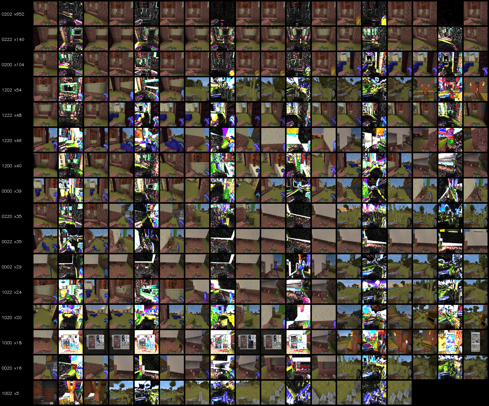
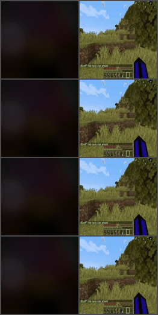
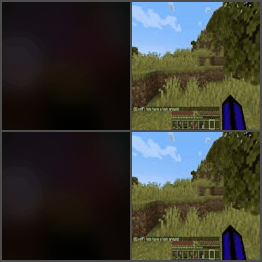

# PRISM — Primitive Rendering for Interactive Scene Modeling

A research project building a controllable game world model from unlabelled video, using differentiable object-centric representations and unsupervised action discovery.

| Phase | What it learns | Status |
|-------|---------------|--------|
| **1 — Static** | Decompose images into geometric primitives | ✅ Complete |
| **2 — Temporal** | How primitives evolve over time | ✅ Complete |
| **3 — Controllable** | Unsupervised action codes from frame pairs | 🔄 Training |
| **3b — Long-horizon** | Stable multi-step rollouts | ⏳ Pending P3 |
| **4 — Multi-agent** | Consistent world state across two agents | 🔬 Future |
| **5 — Language** | Text-conditioned world editing | 🔬 Future |

---

## Samples

### Code atlas (Phase 3)

The code atlas is generated by running `engine.py --observe` on real video clips. LAM labels every consecutive frame pair with a 4-digit code (one entry per codebook). The atlas collects these labels and organises them into a grid:

- **Left column** — the 4-digit code (e.g. `0123`) and how many times it was observed
- **Each subsequent triple** — `before | Δ×5 | after`, where Δ is the amplified pixel difference between the two frames. Black = nothing changed; bright = large motion or appearance change. Up to 6 triples per code, sorted by frequency.

Reading the atlas: rows with a uniform bright Δ across the whole frame are camera pans; rows with a bright band at the bottom are jumps; rows with near-black Δ are near-null actions.



### Action rollouts (Phase 3, step 164 200)

Each GIF shows the world model rolling out 8 steps under a fixed action code. Left column = primitive canvas (geometric structure), right column = reconstructed image. Each row is a different code from the atlas, sorted by real-world frequency. The null code (lam(frame, frame)) is always the first row.





---

## Current status

Phase 3 is actively training on Minecraft footage at 128×128. The Latent Action Model (LAM) successfully discovers 4 action axes via multi-codebook VQ (256 possible combinations), but mapping codes to semantic actions (forward/jump/turn) remains noisy because the training data contains no ground-truth action labels — the model learns purely from frame transitions.

Phase 2 produces stable slot tracking and optical flow. The warp-then-refine architecture in Phase 3 gives sharper reconstructions than direct pixel prediction, but long-horizon rollouts (10+ steps) still drift.

The interactive engine (`engine.py`) is working and includes an observe mode with an automatic code atlas for interpreting learned action codes.

---

## Limitations

- **No supervised actions.** LAM clusters frame transitions unsupervised. Codes are consistent but not guaranteed to align with human-interpretable actions (e.g., the "null" code often maps to slow forward motion, not stillness, because that's the dataset's dominant motion).
- **Low FPS training data.** Videos are sampled at 6fps. Fast actions collapse into a single large flow frame and are hard to disentangle.
- **Single-game generalisation.** Currently trained on Minecraft only. Transfer to other games is untested.
- **Primitive bottleneck.** Scenes are represented as ≤32 soft circles/lines. Complex textures (water, foliage, sky gradients) cannot be captured by the canvas — the I model's UNet compensates, but adds blur.
- **Resolution.** 128×128 is low enough that fine details are lost and small flow vectors (e.g. "standing still" vs "walking slowly") look similar in LAM's feature space.
- **Windows TDR.** Long GPU compute bursts during rollout saving can trigger the Windows GPU watchdog. Use `--no-output` during training if crashes occur.

---

## Toy run (quick pipeline check)

To verify the pipeline without real data, train Phase 1 on a small synthetic dataset (a folder of random images):

```bash
# 1. Create a tiny image dataset (any JPEGs work)
mkdir data/images
# copy 100+ images into data/images/

# 2. Edit config.py
#    FLICKR_DIR = "data/images"
#    MAX_IMAGES = 500
#    NUM_EPOCHS = 5

# 3. Run
python train.py
# Samples appear in samples/ after 500 steps
```

For a Phase 2/3 check with a short video clip:

```bash
# Extract frames from any short video (even 30s works)
python preprocess_videos.py --config p2 --fps 6 --size 64

# Edit config_p2.py: FRAMES_DIR = "data/frames_6fps_64px"  MAX_VIDEO_PAIRS = 500
python train_p2.py
```

---

## Installation

```bash
pip install -r requirements.txt
```

CUDA GPU required for reasonable training speed. Developed with PyTorch 2.x on Windows (Linux/macOS untested but should work).

---

## Repository structure

```
config.py              # Phase 1 hyperparameters (shared base)
config_p2.py           # Phase 2 overrides
config_p3.py           # Phase 3 overrides
config_p3b.py          # Phase 3b overrides
model.py               # All neural network architectures (O, I, N, LAM, VQCodebook)
rasterizer.py          # Differentiable soft primitive renderer + optical flow
dataset.py             # Image dataset (Phase 1)
dataset_video.py       # Video frame dataset (JPEG / decord backends)
train.py               # Phase 1 training
train_p2.py            # Phase 2 training
train_p3.py            # Phase 3 training
train_p3b.py           # Phase 3b training (long-horizon unrolling)
preprocess_videos.py   # Extract JPEG frames from videos (run once before Phase 2/3)
remux_faststart.py     # Remux MP4s with faststart header (faster decord seeking)
engine.py              # Interactive inference engine + observe/atlas mode
loss.ipynb             # Notebook to plot training losses
media/                 # Showcase GIFs and images (tracked by git)
```

---

## Phase 1 — Static image reconstruction

**Goal:** Learn to represent images as sets of soft geometric primitives.

### Configure

```python
# config.py
FLICKR_DIR = r"data/images"   # any folder of images
IMAGE_SIZE  = 128
MAX_SLOTS   = 32
PRIMITIVE   = "mixed"         # "circle" or "mixed" (circles + lines)
```

### Train

```bash
python train.py
```

Samples → `samples/`.  Checkpoints → `checkpoints/`.

---

## Phase 2 — Temporal dynamics

**Goal:** Learn how primitive slots evolve between consecutive frames.

### Configure

```python
# config_p2.py
VIDEO_DIR  = r"data/videos"
FRAMES_DIR = r"data/frames_6fps_128px"  # output of preprocess_videos.py, or None
```

### Preprocess (recommended for long recordings)

```bash
python preprocess_videos.py --config p2 --fps 6 --size 128
```

### Train

```bash
python train_p2.py
```

Samples → `samples_p2/`. Loads Phase 1 weights automatically.

---

## Phase 3 — Action world model

**Goal:** Discover discrete action codes from unlabelled video and predict future frames conditioned on them.

LAM encodes `(frame_t, frame_{t+1})` into a **multi-codebook VQ code** — 4 independent codebooks × 4 entries = 256 possible combinations. Gradients flow back through the straight-through estimator to teach LAM which visual changes matter.

### Configure

```python
# config_p3.py
VIDEO_DIR  = r"data/videos"
FRAMES_DIR = r"data/frames_6fps_128px"

FREEZE_O   = False   # freeze to speed up training once O has converged
FREEZE_LAM = False   # freeze once VQ codes are stable (vq_uniq stays at 4)
```

### Train

```bash
python train_p3.py
python train_p3.py --no-output   # skip GIF saving (avoids CUDA TDR on Windows)
```

### Observe + code atlas

```bash
python engine.py --observe
```

- `s` — save `code_atlas.png` + `code_atlas.json` (maps codes to representative frame pairs)
- `space` — next random clip  |  `x` — quit (auto-saves)

Once `code_atlas.json` exists, rollout GIFs automatically use the most-frequent real gameplay codes.

---

## Phase 3b — Long-horizon fine-tuning

**Goal:** Stable multi-step rollouts that don't drift.

```python
# config_p3b.py
P3B_UNROLL_STEPS  = 10
P3B_TRUNCATE_BPTT = 5
FREEZE_O          = True   # O doesn't benefit from longer horizons
```

```bash
python train_p3b.py
python train_p3b.py --no-output
```

---

## Interactive engine

```bash
python engine.py                     # normal mode
python engine.py --seed frame.jpg    # specific starting image
python engine.py --fps 6 --scale 8  # slower, bigger window
python engine.py --observe           # watch real video + live code HUD
python engine.py --multiplayer       # two agents sharing world state (Phase 4 preview)
```

The window shows **reconstructed image | canvas** side by side.
The canvas panel has a live 4×4 HUD: rows = codebooks, columns = entries, lit square = currently active code.

| Keys (normal mode) | Action |
|--------------------|--------|
| Letter/number keys | Hold to activate a specific codebook entry |
| `n` | New random seed frame |
| `s` | Save current frame |
| `x` / ESC | Quit |

Edit `KEY_TO_BIT` in `engine.py` to remap keys once you've identified which codes correspond to which in-game actions via the code atlas.

---

## Future directions

### Phase 4 — Multi-agent

Two independent agents sharing a common world state. Each agent has its own view and action history; a shared global embedding makes their worlds consistent when they meet.

- **LSE (Local State Encoder)** — encodes each agent's `(frame, slots, action)` into a local latent
- **GA (Global Aggregator)** — attention-pools the two local latents into a shared world embedding
- **Convergence loss** — agents given the same start and shuffled-but-identical action sequences must converge to the same final frame

The engine supports `--multiplayer` today (same model, two views, shared world), but the LSE/GA training loop is not yet implemented.

### Phase 5 — Language conditioning

A "god mode" chat box: type anything and it materialises in the game (*"place a bridge over this river"*, *"switch to first-person view"*).

Approach: inject `(before, after, caption)` triplets into training every N batches. A language encoder (frozen CLIP or lightweight trained embedding) conditions N and I through the world embedding pathway — the same mechanism used for action codes.

---

## Architecture

**O — ObjectGenerator**

CNN encoder (4 stride-2 stages, 3→32→64→128→256 channels) → `AdaptiveAvgPool2d(4)` → MLP → `(B, MAX_SLOTS, SLOT_DIM)`. Resolution-agnostic: weights trained at any resolution transfer cleanly.

**N — SlotTransition**

Transformer on slot pairs `(params_prev, params_curr)` as queries, image patch tokens as cross-attention keys/values. Conditioned on the VQ action embedding (128-dim, straight-through) and optionally a world embedding. Outputs bounded slot deltas (`tanh × MAX_DELTA`).

**I — ImageReconstructorP2**

Warp-then-refine UNet. Input: `[flow(2ch) ∥ warped_frame(3ch)]`.
1. Warp `frame_t` by predicted optical flow (bilinear backward warp)
2. UNet predicts residual correction for warp artifacts
3. Output: `clamp(warped + Δ, 0, 1)`

Also conditioned on the VQ action embedding for non-spatial effects (colour changes, UI elements).

**LAM — LatentActionModel**

6-channel CNN `(frame_t ∥ frame_{t+1})` → GlobalAvgPool → MLP → multi-codebook VQ.
- `z_q_st` (B, C×D=128) — quantized embedding with STE gradient → passed to N and I
- `action_code` (B, C×E=16) — one-hot, used for logging and HUD only

**Rasterizer**

Differentiable soft rendering via coverage maps, composited back-to-front (Porter-Duff). Also computes per-pixel optical flow from slot motion between `params_curr` and `params_next`.

---

## Slot layout (`PRIMITIVE = "mixed"`)

| Index | Key | Range | Meaning |
|-------|-----|-------|---------|
| 0 | `exists` | [0, 1] | Slot occupancy |
| 1 | `type` | [0, 1] | 0 = circle, 1 = line |
| 2 | `cx` | [−1, 2] | Centre x (can go off-screen) |
| 3 | `cy` | [−1, 2] | Centre y |
| 4 | `p1` | [0, 0.5] | Radius / half-length |
| 5 | `p2` | [0, π] | Line angle |
| 6 | `p3` | [0, 0.1] | Line half-width |
| 7–9 | `r g b` | [0, 1] | Colour |
| 10 | `alpha` | [0, 1] | Transparency |
| 11 | `sharpness` | [σ_min, σ_max] | Learnable edge softness |
| 12 | `depth` | (−∞, +∞) | Compositing order |
